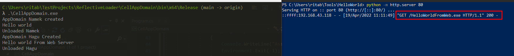

# Reflective Loader 

I have created this repository for practice and reference of creating reflective loader in C#. The original source code is taken from [SANS Workshop - Reflection in C#](https://www.youtube.com/watch?v=qeOCZGuVsi4) by [Jean-François Maes](https://twitter.com/Jean_Maes_1994)

I am planning to add my updates to the loader as I progress and add this to other projects as well.

## Working of the Reflective loader with AppDomain

- The first AppDomain that is created will load the first `.NET` binary `HelloWorld.exe`
- The second one will download the second `.NET` binary `HelloWorldFromWeb.exe` and load it using reflection

